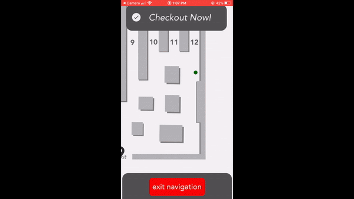

# Demo

ShopSmart is an application built on React Native and Firebase that calculates the fastest route through a store based on a user provided list of groceries. It accomplishes this efficient routing by applying the 2-opt heuristic algorithm to the Traveling Salesman Problem: what is the shortest route through a graph in which every target node is visited given a defined start and end point? 
In the context of a shopping trip, the checkout/entrance to the store is that start/end node and the locations of the various items become the other nodes.

The map functionality was created using animations and react-native-svg; no APIs or external map applications were used. 

Part 1 Demo (Routing a shopping trip): 

Part 2 Demo (Basic functionality): 

